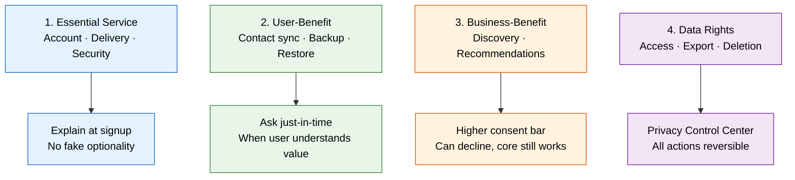

# WhatsApp × DPDP Act — Product Case Study

A product case study on redesigning WhatsApp's data consent and privacy architecture to comply with India's **Digital Personal Data Protection (DPDP) Act, 2023** — while preserving the core messaging experience.

[Product Deck](https://docs.google.com/presentation/d/1CPIi0uNnTII0yYop3AJ28W6HxaDYKvONWhcoswp4dkQ/edit?usp=sharing) · [Live Prototype](https://whatsapp-dpdp.vercel.app/) · [Brief](./assignment.md)

---

## Problem

WhatsApp is expanding beyond pure messaging into business messaging, discovery surfaces, usernames, backup, and monetization layers. This creates a product tension:

> Users come to WhatsApp for private, low-friction communication. The company needs to build more identity, business, and monetization layers around that core. The DPDP Act raises the bar on how clearly data uses must be explained.

The typical approaches fail:
- **One big consent wall** — high friction, low comprehension, "consent collected" does not mean "consent understood"
- **Bury everything in settings** — low discoverability, privacy becomes reactive, trust is never earned at the moment of use

---

## Approach: Purpose-Based Data Use Architecture

The core product decision: **do not treat all data uses the same.** Split them into 4 buckets, each with its own consent rule.



---

## Solution: 3-Layer System

```
┌─────────────────────────────────────────────┐
│  Layer 1: Essential Data Use Notice          │
│  At signup — short, honest, required-only    │
├─────────────────────────────────────────────┤
│  Layer 2: Contextual Consent Prompts         │
│  Just-in-time — when the user needs the      │
│  feature and can evaluate the trade-off      │
├─────────────────────────────────────────────┤
│  Layer 3: Privacy Control Center             │
│  One screen to review, toggle, and revoke    │
│  all consents. Also handles data requests.   │
└─────────────────────────────────────────────┘
```

---

## Prototype Screens

Built as a mobile-first, dependency-free web app with 7 screens showing the full consent flow.

<table>
  <tr>
    <td width="33%"></td>
    <td width="33%"></td>
    <td width="33%"></td>
  </tr>
  <tr>
    <td align="center"><b>Essential Notice</b><br>Shown at signup — what is<br>required and what comes later</td>
    <td align="center"><b>Contact Sync</b><br>Prompted when user tries<br>to find contacts</td>
    <td align="center"><b>Location</b><br>Purpose-specific consent<br>for discovery features</td>
  </tr>
  <tr>
    <td width="33%"></td>
    <td width="33%"></td>
    <td width="33%"></td>
  </tr>
  <tr>
    <td align="center"><b>Backup Consent</b><br>Proactively prompted after<br>meaningful chat activity</td>
    <td align="center"><b>Privacy Control Center</b><br>Centralized toggles for all<br>consent categories</td>
    <td align="center"><b>Data Request Status</b><br>Track access, export,<br>and deletion requests</td>
  </tr>
</table>

Key prototype features:
- Context-aware progressive disclosure (spotlight cards adapt to user state)
- Bottom sheet modals for consent decisions
- Toggle switches with immediate feedback (all reversible in-app)
- URL-persisted state for direct screen access (`?screen=privacy`)
- Data request timeline with SLA tracking
- Accessibility: `aria-label`, `role="switch"`, `aria-live="polite"`, `prefers-reduced-motion`

---

## Metrics Framework

| Type | Metric | What It Measures |
|---|---|---|
| **North Star** | Consent Quality Rate | % of MAUs with a valid, current consent state across optional data uses |
| Supporting | Consent acceptance by purpose | Breakdown for contact sync, backup, discovery |
| Supporting | Withdrawal rate by purpose | Tracks whether users revoke consent after granting it |
| Supporting | Backup enablement after explanation | Does proactive explanation drive opt-in? |
| Supporting | Privacy Control Center MAU | Engagement with ongoing controls |
| Supporting | SLA completion for rights requests | % of data access/export/deletion requests completed on time |
| Guardrail | Signup completion | Must not degrade |
| Guardrail | Day-7 messaging activity | Core engagement must stay healthy |
| Guardrail | Contact-find success | Contact discovery must still work |
| Guardrail | Privacy support tickets | Should decrease, not spike |

**Trade-off:** Better explanations may lower some acceptance rates for non-essential uses. That is not automatically failure — it may indicate better comprehension, healthier consent quality, and lower long-term trust risk.

---

## Key Decisions & Trade-offs

- **Backup is treated differently from contact sync.** Both are optional, but backup protects emotionally valuable data (chat history). It is proactively recommended after meaningful usage, not buried in settings — and not forced at signup.
- **Contact sync is asked just-in-time**, not during onboarding. The user can see the value (finding existing contacts) and can decline without losing core messaging.
- **Business-benefit uses (discovery, personalization) carry a higher consent bar.** The company is the primary beneficiary, so the user should be able to say no without affecting basic messaging.
- **The Privacy Control Center is the proof layer, not the whole solution.** A dashboard alone does not fix consent design — the real work is in when and how each consent is asked.
- **Engineering complexity increases** because permissions must be tracked by purpose, not as a loose settings bundle.
- **Short-term visibility may surface user anxiety** — things that were previously invisible will now be visible. This is a necessary cost of compliance.

---

## Rollout Plan

```
Internal dogfood → 1% India cohort (Android) → Monitor metrics →
Expand by use case → Expand by platform → Full rollout
```

---

## Project Structure

```
├── index.html                   # Main HTML shell
├── styles.css                   # All styling
├── app.js                       # Screen rendering, state management
├── assets/                      # Screenshots
│   ├── First page needed permissions consent.png
│   ├── contacts permission consent.png
│   ├── Location permission consent.png
│   ├── chat backup consent.png
│   ├── Privacy setting and data request Panel.png
│   └── Data Request Ticket page.png
├── outputs/
│   └── whatsapp-dpdp-deck-v7.pptx
├── assignment.md                # Case study brief
├── whatsapp_dpdp_strategy.md    # Full strategy documentation
├── prototype_handoff.md         # Technical handoff notes
├── deck_architecture.md         # Deck structure guide
└── presentation_brief.md        # Visual and tone guidance
```

---
[Mujtaba Jafri](https://www.linkedin.com/in/mujtaba30/) · [GitHub](https://github.com/MujtabaJ30/whatsapp-dpdp)
